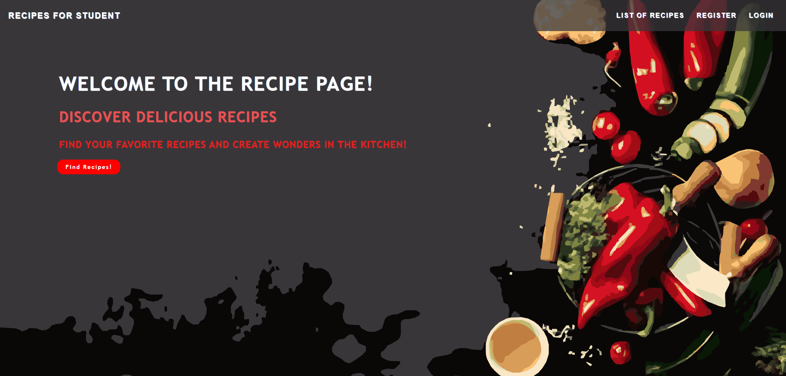
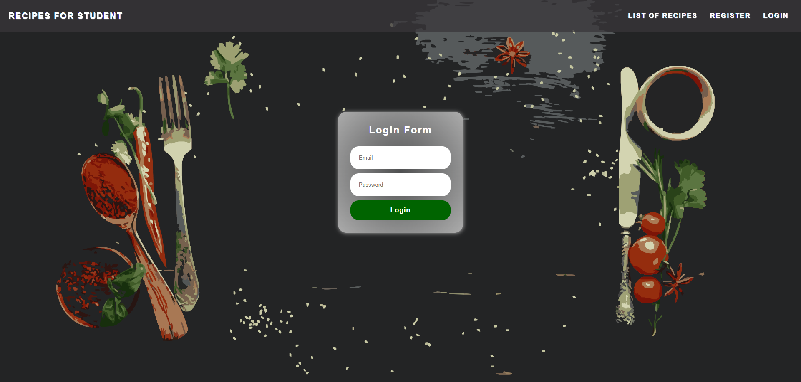
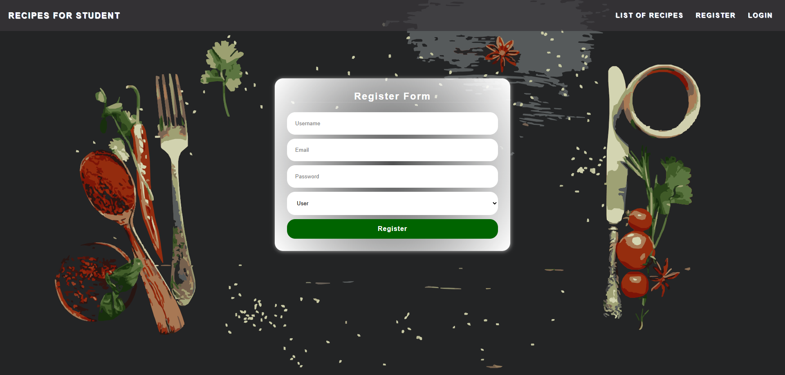

# 🍽️ Recipes for Student

**Recipes for Student** is a full-stack recipe management platform tailored for students.  
It offers user authentication, recipe sharing, interaction features, and shopping list capabilities.  
Only registered users can navigate and access the application features.

---

## 🚀 Features

- 🔐 **JWT-based user authentication** (Register / Login)
- 📅 View all recipes by **posting date**
- 🍳 **Create, update, and delete recipes**
- 🚫 Route protection for **non-authenticated users**
- 📥 **Follow** other users and receive updates
- ❤️ **Like** recipes and leave **comments**
- 📧 **Send emails** to other users
- 🛒 Create and manage your **shopping list**
- 🌐 Responsive and student-friendly interface

---

## 🛠️ Tech Stack

| Layer         | Technologies                                      |
|---------------|---------------------------------------------------|
| Frontend      | React.js, Redux, CSS                              |
| Backend       | Node.js, Express.js                               |
| Database      | MongoDB with Mongoose                             |
| Authentication| JWT (JSON Web Tokens)                             |
| Caching       | Redis                                             |
| Email Service | Nodemailer                                        |
| Tools         | Postman, Git, GitHub, VS Code                     |

---

## 📷 Screenshots

### 🏠 Home Page


### 🔐 Login Page


### 📝 Register Page


---

## 📦 Getting Started

Clone the repository:

```bash
git clone https://github.com/kuyucucaner/Recipes-for-student.git
cd recipes-fpr-student
cd backend / npm install
cd frontend /npm install
npm install

---
## 🛡️ Environment Variables

PORT=5000
MONGO_URI:your_mongo_uri
JWT_SECRET:your_jwt_secret
REFRESH_TOKEN_SECRET:your_refresh_token_secret
MAIL_ID:your_mail_id
MAIL_PASSWORD:your_mail_password

---
## ▶️ Run the App
 npm start 
